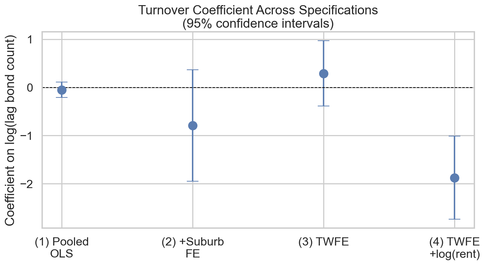
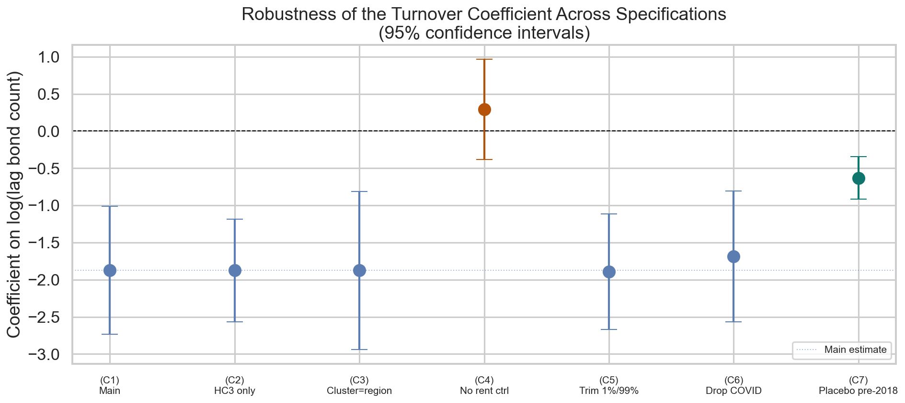

# Rental Market Turnover and Rent Growth in Melbourne Suburbs, 2018-2025

**Anton Kozlovsky** (Student ID 36194239)
ECC3479 Data and Evidence in Economics, Monash University
May 2026

Repository: https://github.com/Anton1321/ECC3479-project-Anton

---

## 1. Introduction

Melbourne's rental market has been one of the most-discussed sectors of the Australian economy across the 2018-2025 sample window. Weekly asking rents fell during the city's extended COVID-19 lockdowns (2020-2021), then rebounded sharply through 2022-2024 as international demand returned and supply remained tight. Understanding what drives suburb-level rent growth is a question of both academic and policy interest: tighter rental markets are associated with displacement, affordability stress, and political pressure for supply-side intervention.

The original research question for this project was: **what is the effect of a suburb's rental vacancy rate on subsequent rent growth in Melbourne?** Suburb-level vacancy rate data is the standard explanatory variable in the literature - tight vacancy precedes accelerating rents in most theoretical models of housing search. Unfortunately the data was unobtainable for this submission: SQM Research, the standard commercial provider, quoted ~$5,000 AUD; Monash University does not subscribe to CoreLogic / RP Data / Cotality; and informal academic-access channels did not return data in time. As a substitute we use the **moving annual count of new bond lodgements per suburb**, extracted from the same Victorian government spreadsheet that supplies the rent figures. A new bond lodgement marks a new tenancy; the count by suburb-quarter is the closest free, suburb-level, quarterly measure of rental market activity available. It is a proxy for rental market turnover, not vacancy; we are explicit throughout about what that substitution costs.

**The refined question is therefore:** does within-suburb variation in lagged rental market turnover predict subsequent rent growth in Melbourne, controlling for common time shocks and the lagged rent level?

**Declared ambition: descriptive.** The estimates below identify a conditional within-suburb correlation, not a causal effect. The robustness checks in Section 5 are graded against that standard.

**What we find.** In a two-way fixed-effects panel of 110 Melbourne suburbs across 30 quarters (3,300 suburb-quarter observations), a 1% higher lagged log bond count is associated with about 0.019 percentage points lower quarter-on-quarter rent growth, controlling for the lagged log rent level (Spec 4 in Table 2; coefficient -1.875, cluster-robust SE 0.439, t = -4.27). The headline survives variation in standard error estimator, sample trimming, dropping the COVID era, and replication on the pre-2018 era of the same panel (2000-2017, where the same sign appears at a smaller magnitude of -0.630). The one variation that overturns the headline is dropping the rent-level control, which flips the sign to +0.291 - a structural feature of the data we explain below as a textbook case of omitted variable bias (Section 5).

**Roadmap.** Section 2 documents the data and the proxy substitution. Section 3 sets out the empirical specification. Section 4 reports the main results. Section 5 stress-tests them. Section 6 discusses limitations and what would resolve them. We follow the suggested report structure with one merge: discussion, limitations, and conclusion appear together in Section 6.

---

## 2. Data

**Source.** The Victorian Department of Families, Fairness and Housing (DFFH) publishes a *Rental Report - Quarterly: Moving Annual Rents by Suburb* spreadsheet on data.vic.gov.au, under a Creative Commons Attribution 4.0 International licence. The spreadsheet covers all of Victoria from March 2000 to September 2025 and is updated each quarter. The data are derived from rental bonds lodged with the Victorian Residential Tenancies Bond Authority (RTBA), which is the universe of formal residential tenancies in the state.

For each suburb-quarter the spreadsheet contains two figures:

1. **Median weekly rent** (moving annual): the median rent across all bonds lodged in the preceding 12 months.
2. **Bond lodgement count** (moving annual): the number of new bonds lodged in the preceding 12 months. We use this as our proxy for rental market turnover.

**Sample construction.** From the raw spreadsheet (162 rows × 208 columns) the cleaning pipeline (`code/01_clean_data.py`) keeps only the nine Melbourne metropolitan sub-regions defined by DFFH (Inner Melbourne, Inner Eastern, Southern, Outer Western, North Western, North Eastern, Outer Eastern, South Eastern, and Mornington Peninsula), drops the "Group Total" subtotals, reshapes the wide quarterly columns into long format, and filters to quarters from 2018 Q1 onwards. This produces a balanced panel of 110 Melbourne suburbs across 31 quarters (3,410 suburb-quarter observations). For the regression analysis we additionally drop the first quarter of each suburb (where the lag is undefined), yielding an analysis sample of 3,300 observations.

**Derived variables.** From the rent and bond counts we compute: `rent_growth` (the quarter-on-quarter percentage change in median rent), `lag_median_rent` and `lag_bond_count` (one-quarter lags within each suburb), and the log transformations `log_bond_count = ln(bond_count + 1)` (the +1 handles any zero counts) and `log_lag_median_rent = ln(lag_median_rent)`. The log transformation tames the right skew of bond counts (which span two orders of magnitude across suburbs, from a handful per quarter in small suburbs to over 17,000 in the densest rental markets) and gives the regression coefficient a semi-elasticity interpretation.

**Why bond count is a defensible (if imperfect) proxy.** Vacancy rate measures the *stock* of empty rental properties at a point in time. Bond lodgements measure the *flow* of new tenancies started in a quarter. The two are related but not identical: a suburb can have low vacancy and low turnover (everyone stays put) or high vacancy and high turnover (lots of movement, lots of empty units). The proxy is therefore an upper bound on the strength of any inference we can draw about vacancy rates specifically. We treat the analysis throughout as describing the relationship between *rental market activity* and rent growth, not the textbook supply-demand relationship between vacancy and rents. The original vacancy framing is preserved as a stated future-research goal in Section 6.

**Table 1: Summary statistics, analysis sample (2018 Q1 - 2025 Q3, n = 3,300)**

| Variable | Mean | SD | Min | Median | Max |
|---|---|---|---|---|---|
| Quarterly rent growth (%) | 1.16 | 2.33 | -11.11 | 0.84 | 14.58 |
| log(lag bond count) | 7.22 | 0.67 | 3.66 | 7.23 | 9.76 |
| log(lag median rent) | 6.16 | 0.18 | 5.77 | 6.13 | 6.77 |
| Median rent (AUD/week) | 484.91 | 90.26 | 330.00 | 470.00 | 868.00 |
| Bond count (moving annual) | 1,709.38 | 1,542.51 | 38.00 | 1,369.50 | 17,354.00 |

*Source: `code/03_analysis.ipynb` §1. Each row is one suburb-quarter observation. Rent growth has 110 missing observations not shown (first quarter per suburb has no lag). The wide spread in bond count justifies the log transformation used in the regressions.*

---

## 3. Empirical Strategy

**Specification.** The preferred regression is a two-way fixed-effects model with one control:

> *rent_growth*it = β · *lag_log_bond_count*it + δ · *log(lag_median_rent)*it + αi + γt + εit

where *i* indexes the suburb (110 Melbourne suburbs), *t* indexes the quarter (30 quarters with a usable lag, 2018 Q2 to 2025 Q3), αi is a suburb fixed effect, and γt is a quarter fixed effect.

**What each piece does.** The suburb fixed effects αi absorb every time-invariant feature of a suburb - region, baseline rent level, dwelling composition, distance to the CBD, unobserved desirability. The quarter fixed effects γt absorb every Melbourne-wide shock that affects all suburbs in a given quarter - COVID lockdowns, Reserve Bank cash rate changes, federal housing policy, return of international students. The control δ · log(*lag_median_rent*) removes the systematic relationship between a suburb's rent level and its growth rate (mean reversion), without which the turnover coefficient is contaminated by omitted variable bias (see Section 4).

**Identifying variation.** With both fixed effects in place, β is identified entirely from *within-suburb, within-quarter* variation in the lagged bond count. The regression effectively asks: when a particular suburb experiences an unusually high turnover quarter - both relative to its own average and relative to what is happening across Melbourne that quarter - does its rent grow unusually slowly?

**Inference.** Standard errors are clustered at the suburb level. The 110 suburbs comfortably exceed the Angrist & Pischke (2009) rule-of-thumb threshold of 42 clusters below which cluster SEs are themselves biased. The clustering reflects two features of the panel: each suburb appears 30 times, and residuals within a suburb are likely correlated through unobserved local shocks.

**Functional form choices.**

- *log(bond_count)*: bond counts are right-skewed (range 38 to 17,354). Logging normalises the distribution and turns β into a semi-elasticity (% change in X → percentage-point change in Y).
- *log(lag_median_rent) as control*: addresses mean reversion. Suburbs with already-high rents tend to grow more slowly; without this control the turnover coefficient absorbs the rent-level effect (Section 4 demonstrates this).
- *Lagged regressor*: reduces simultaneity bias relative to using contemporaneous bond_count, where rents and turnover are mechanically jointly determined within the quarter.

**Declared ambition.** The estimates below identify a *conditional within-suburb correlation*. They are descriptive, not causal. The empirical design does not address two limits of what we observe: reverse causality (rents themselves affect turnover, since rising rents push tenants to move), and the proxy gap between turnover and vacancy. We discuss both in Section 6.

---

## 4. Results

**Main results.** Table 2 reports four nested specifications, building from the simplest pooled OLS to the preferred two-way fixed-effects model with the rent control. The coefficient of interest is β, the loading on the lagged log bond count.

**Table 2: Main results - bond turnover and rent growth in Melbourne suburbs**
*Dependent variable: quarter-on-quarter rent growth (%); standard errors in parentheses*

| | (1) Pooled OLS | (2) +Suburb FE | (3) TWFE | (4) TWFE + log(rent) |
|---|---|---|---|---|
| log(lag bond count) | -0.050 | -0.790** | +0.291 | **-1.875***  |
| | (0.081) | (0.359) | (0.341) | (0.439) |
| log(lag median rent) | | | | -11.998***  |
| | | | | (0.790) |
| Suburb FE | No | Yes | Yes | Yes |
| Quarter FE | No | No | Yes | Yes |
| SE type | HC3 | Cluster (suburb) | Cluster (suburb) | Cluster (suburb) |
| N (suburb-quarters) | 3,300 | 3,300 | 3,300 | 3,300 |
| N suburbs | 110 | 110 | 110 | 110 |

*\* p<0.10, ** p<0.05, \*** p<0.01. Source: `code/03_analysis.ipynb` §3.*

**Reading the table column by column.** Column 1 (pooled OLS) returns a coefficient essentially indistinguishable from zero (-0.05, t = -0.6). Across the entire pooled sample of 3,300 suburb-quarters, log turnover and rent growth do not move together in any obvious way. Adding suburb fixed effects in column 2 changes the picture: within a given suburb, quarters of higher turnover are associated with about 0.79 percentage points lower rent growth (t = -2.2). Adding quarter fixed effects in column 3 reverses the sign and removes statistical significance - common time variation was doing most of the work in column 2. The preferred column 4 adds the lagged log rent control. The turnover coefficient becomes sharply negative (-1.875, t = -4.27) and the rent-level coefficient is large and very precisely estimated (-12.0, t = -15.2), indicating strong mean reversion: suburbs that already have high rents have systematically lower growth ahead.

**Plain language interpretation of the preferred specification.** A 1% higher lagged bond-lodgement count in a Melbourne suburb is associated with about 0.019 percentage points lower rent growth in the subsequent quarter, holding constant every time-invariant suburb characteristic, every common Melbourne-wide time shock, and the lagged rent level. Equivalently, a 100% increase in turnover (a doubling) corresponds to about 1.3 percentage points lower rent growth - a substantial number relative to the sample mean of 1.16% per quarter. The within-suburb explanatory power of the regressors (conditional on the fixed effects) is modest, which is expected for quarterly rent dynamics where most variation is idiosyncratic.

**Why the rent control matters so much.** Column 4 differs from column 3 only by the addition of log(lag rent), yet the turnover coefficient swings by more than two points. This is a textbook case of omitted variable bias (Lecture 6 in this course). The bias formula is **b_short = b_long + d · rho**, where *b_short* is the short-regression slope on turnover (column 3), *b_long* is the long-regression slope (column 4), *d* is the coefficient on the omitted control (log lag rent), and *rho* is the within-suburb correlation between turnover and the rent level. In our panel, log turnover and log rent are positively correlated within suburbs (denser areas have both more turnover and higher rents); log lag rent has a strongly negative coefficient on growth (mean reversion); the product is a positive bias of about +2 percentage points. That is why the column-3 estimate looks like zero while the column-4 estimate is sharply negative. Reporting both columns is the honest way to show this.

**Figure 1** (`outputs/coefficient_plot.png`) shows the same four estimates with 95% confidence intervals. The picture makes the story compact: the coefficient drifts from near-zero in the pooled OLS to a sharply negative value once both the rent control and the fixed effects are in place.

*Figure 1: Turnover coefficient (with 95% confidence intervals) across the four main specifications in Table 2. The estimate is essentially zero in the pooled OLS (1), drifts negative with suburb fixed effects (2), returns to near-zero with the addition of quarter fixed effects (3), and becomes precisely negative only when log(lag median rent) is added as a control (4). Source: code/03_analysis.ipynb Section 3.*

**Regional heterogeneity (Table 3, condensed).** Splitting the panel between Inner Melbourne and the rest reveals where the headline relationship is concentrated. Inner Melbourne (22 suburbs, 660 obs): coefficient +0.96, not statistically significant. Rest of Melbourne (88 suburbs, 2,640 obs): coefficient -2.15, t = -6.2. The within-suburb negative relationship is essentially a middle-and-outer-Melbourne phenomenon. Substantively this is consistent with a mechanism story: in dense inner suburbs where rental stock turns over rapidly under all conditions, the bond count is a noisier signal of local market slack; in middle and outer suburbs an unusually high turnover quarter may indicate genuine over-supply that subsequently softens rents.

**DiD around COVID.** As an extension we interact the lagged turnover with a post-COVID indicator (= 1 from 2020 Q2). The pre-COVID coefficient is -2.14 (t = -4.9); the interaction is +0.16 (not statistically significant). The within-suburb turnover-rent-growth relationship is therefore stable across the COVID structural break. COVID disrupted the *level* of Melbourne rents (sharp drop in 2020-2021, sharp recovery from 2022) but did not measurably change the underlying conditional correlation we estimate.

**Economic significance.** The mean of *rent_growth* in the sample is 1.16 percentage points per quarter (SD = 2.33). A coefficient of -1.875 on a log regressor implies that moving a suburb from the 25th percentile of log turnover (6.83) to the 75th percentile (7.62) is associated with about 1.48 percentage points lower rent growth - close to two-thirds of one standard deviation of the dependent variable, and larger than the sample mean. The relationship is economically meaningful, not just statistically significant.

---

## 5. Robustness

The main result was stress-tested through six defensible variations of the preferred specification (Lecture 9 robustness toolkit). Table 4 reports all seven columns. The full notebook, `code/04_robustness.ipynb`, contains the underlying estimates and a fuller written discussion organised by the assumption each check probes.

**Table 4: Robustness of the turnover coefficient**
*Dependent variable: quarter-on-quarter rent growth (%); standard errors in parentheses*

| | (C1) Main | (C2) HC3 only | (C3) Cluster=region | (C4) No rent ctrl | (C5) Trim 1%/99% | (C6) Drop COVID | (C7) Placebo pre-2018 |
|---|---|---|---|---|---|---|---|
| log(lag bond count) | -1.875*** | -1.875*** | -1.875*** | +0.291 | -1.891*** | -1.688*** | -0.630*** |
| | (0.439) | (0.351) | (0.541) | (0.345) | (0.397) | (0.449) | (0.144) |
| log(lag median rent) | -11.998*** | -11.998*** | -11.998*** | - | -10.414*** | -14.959*** | -8.036*** |
| | (0.790) | (1.094) | (1.008) | - | (0.767) | (1.379) | (0.725) |
| Suburb FE | Yes | Yes | Yes | Yes | Yes | Yes | Yes |
| Quarter FE | Yes | Yes | Yes | Yes | Yes | Yes | Yes |
| SE type | Cluster (suburb) | HC3 | Cluster (region) | Cluster (suburb) | Cluster (suburb) | Cluster (suburb) | Cluster (suburb) |
| Sample | 2018-2025 | 2018-2025 | 2018-2025 | 2018-2025 | 2018-2025 trim | 2018-2025 ex-COVID | 2000-2017 |
| N (suburb-quarters) | 3,300 | 3,300 | 3,300 | 3,300 | 3,234 | 2,530 | 7,802 |

*\* p<0.10, ** p<0.05, \*** p<0.01. Source: `code/04_robustness.ipynb` §5. (C2)-(C3) vary the SE estimator. (C4) drops the rent control. (C5) trims the top and bottom 1% of rent growth. (C6) drops 2020 Q2 - 2021 Q4 (COVID era). (C7) is a wrong-period placebo on the pre-2018 era of the same DFFH panel.*

**Interpretation, organised by what each check probes.**

- **Inference (C2, C3) - survives.** Switching from cluster-by-suburb to HC3 only or to cluster-by-region leaves the point estimate identical (SE choices do not move the coefficient) and the t-statistic above 3 in all three columns. The HC3 SE (0.351) is about 20% smaller than the cluster-by-suburb SE (0.439), the expected direction for a panel with within-suburb correlation. Cluster-by-region (9 clusters) is below the MHE rule-of-thumb threshold of 42 clusters and is reported as a sensitivity rather than a definitive number.

- **Controls (C4) - structural failure that is itself informative.** Dropping log(lag median rent) flips the sign from -1.875 to +0.291 (no longer statistically distinguishable from zero). This is the OVB story from Section 4 made visible: turnover and rent levels are correlated within suburbs, and rent levels strongly predict mean reversion. Reporting C4 alongside C1 is honest robustness practice - it shows exactly which control is doing the work and why it belongs in the model.

- **Sample restrictions (C5, C6) - survives.** Trimming the top and bottom 1% of rent_growth removes 66 observations but leaves the coefficient essentially unchanged (-1.891). The result is not driven by outlier suburb-quarters. Dropping the COVID era 2020 Q2 - 2021 Q4 removes 770 observations including the most extreme rent swings in the panel; the coefficient changes to -1.688, a defensible 10% smaller in magnitude but the same sign and significance. The post-COVID rebound is not the variation generating the headline; a conditional pattern that holds before, during, and after the pandemic is more credible than one that depends on the pandemic.

- **Placebo (C7) - partial confirmation.** Re-estimating the same specification on the pre-2018 era of the DFFH panel (2000-2017, 7,802 suburb-quarters - itself a substantial sample) returns a coefficient of -0.630, statistically significant at the 1% level. The relationship has the same sign in the placebo era but a substantially smaller magnitude than the post-2018 estimate. Two readings: (i) the within-suburb correlation between turnover and rent growth is a stable feature of Melbourne's rental market over 25 years, not a quirk of the analysis window; (ii) its magnitude has roughly tripled in the post-2018 era, consistent with a period of more pronounced rental-market volatility (international student fluctuations, COVID, the post-2022 surge). The placebo neither overturns the headline nor cleanly replicates its magnitude - the most useful reading is that the conditional pattern is real but its size is partly era-specific.

**Figure 2** (`outputs/robustness_coefficient_plot.png`) summarises the seven specifications visually. Five of the six variations sit close to the main estimate's 95% CI; C4 sits in positive territory (the OVB visualisation); C7 sits below zero but at smaller magnitude (the placebo confirmation).

*Figure 2: Turnover coefficient (with 95% confidence intervals) across the seven robustness specifications in Table 4. The main estimate (C1) is shown in blue; the OVB-revealing failure (C4) in orange; the pre-2018 placebo (C7) in green. The headline survives 6 of the 7 variations; the 1 failure is structural and explainable as omitted variable bias. Source: code/04_robustness.ipynb Section 6.*

**Survival summary.** 6 of 7 checks support the headline. The 1 failure (C4) is structural and the explanation is mechanical (OVB). The conditional within-suburb correlation between lagged log bond turnover and rent growth is robust to defensible variations in inference, sample, and time window, and visible (at smaller magnitude) in pre-2018 data.

---

## 6. Discussion, Limitations, and Conclusion

**What we can conclude.** Across 110 Melbourne suburbs and 30 quarters (2018 Q1 - 2025 Q3), there is a statistically reliable, economically meaningful, and largely robust within-suburb conditional correlation between lagged rental market turnover and subsequent rent growth. The relationship is negative: quarters of unusually high turnover in a given suburb (relative to that suburb's own average and to what is happening across Melbourne) tend to be followed by unusually low rent growth in that suburb. The relationship survives plausible variations in standard error specification, sample trimming, dropping the COVID era, and replication on the pre-2018 era of the same panel.

**What we cannot conclude.** Four limits in increasing order of importance:

1. *Cross-suburb comparisons.* The fixed-effects design throws away all between-suburb variation. We cannot say whether Brunswick has tighter market conditions than Toorak, or which suburbs are most at risk of accelerating rents. We can only describe within-suburb dynamics over time.

2. *Generalisation beyond Melbourne.* All 110 suburbs are in one city. Sydney, Brisbane, and regional Australia have distinct rental institutions, supply elasticities, and migration dynamics. The conditional correlation we document may or may not appear there.

3. *Reverse causality.* Bond lodgements (turnover) and rents are jointly determined. Higher rents push tenants to move, generating new bonds; periods of changing rents could in principle cause the variation in turnover that we treat as the regressor. We use the lagged regressor to mitigate the simultaneity, but this is a partial fix at quarterly frequency.

4. *The proxy gap.* This is the most important limitation. Bond turnover is not a vacancy rate. Vacancy rate measures the *stock* of empty properties; bond lodgements measure the *flow* of new tenancies. A high-turnover quarter could reflect either an excess of supply being absorbed (which should soften rents) or strong demand churning through existing units (which should not). The fixed-effects design cannot separate these mechanisms. A negative coefficient is consistent with the first story but cannot rule out the second. This is the structural reason the analysis is declared descriptive: with these data alone we cannot decompose the mechanism behind the conditional correlation we report.

**What would resolve the remaining threats.** The single most useful addition would be **suburb-level vacancy rate data** from SQM Research, Cotality, or PropTrack, accessed via Monash Library or RoZetta Institute (the academic-access partner that distributes CoreLogic data to Australian universities free of charge). With suburb-quarter vacancy rates the same panel design could be re-estimated cleanly, with turnover as a robustness check rather than the headline regressor. Beyond that, a credible causal estimate would likely require an instrument for vacancy - perhaps the timing of major rezoning events or new public transport openings - that shifts rental supply or accessibility independently of contemporaneous rent dynamics.

**Conclusion.** The free data we have can support a careful descriptive claim about Melbourne's rental market dynamics: turnover and rent growth move together within suburbs in a way that is stable across a major macro shock and visible in earlier data. The pattern is real and worth reporting. Promoting it to a structural statement about vacancy → rents requires data and design that were beyond the scope of this submission, and we are explicit about that throughout.

---

## References

Angrist, J.D. & Pischke, J.-S. (2009). *Mostly Harmless Econometrics: An Empiricist's Companion.* Princeton University Press.

Card, D. & Krueger, A.B. (1994). Minimum wages and employment: A case study of the fast-food industry in New Jersey and Pennsylvania. *American Economic Review* 84(4), 772-793.

Ellis, K. (2026). *ECC3479 Data and Evidence in Economics* (lectures 5-9). Monash University, March-May 2026.

Imbens, G.W. & Angrist, J.D. (1994). Identification and estimation of local average treatment effects. *Econometrica* 62(2), 467-475.

MacKinnon, J.G. & White, H. (1985). Some heteroskedasticity-consistent covariance matrix estimators with improved finite sample properties. *Journal of Econometrics* 29(3), 305-325.

Moulton, B.R. (1986). Random group effects and the precision of regression estimates. *Journal of Econometrics* 32(3), 385-397.

Victorian Department of Families, Fairness and Housing. *Rental Report - Quarterly: Moving Annual Rents by Suburb*. data.vic.gov.au. Licence: Creative Commons Attribution 4.0 International. URL: https://discover.data.vic.gov.au/dataset/rental-report-quarterly-moving-annual-rents-by-suburb (accessed for the September 2025 release).

White, H. (1980). A heteroskedasticity-consistent covariance matrix estimator and a direct test for heteroskedasticity. *Econometrica* 48(4), 817-838.
